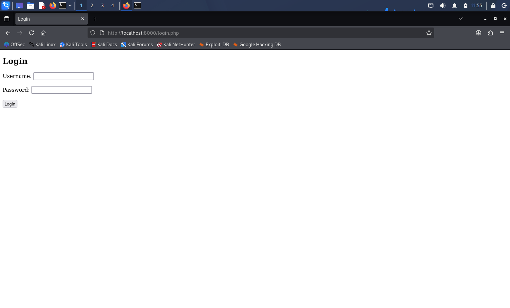
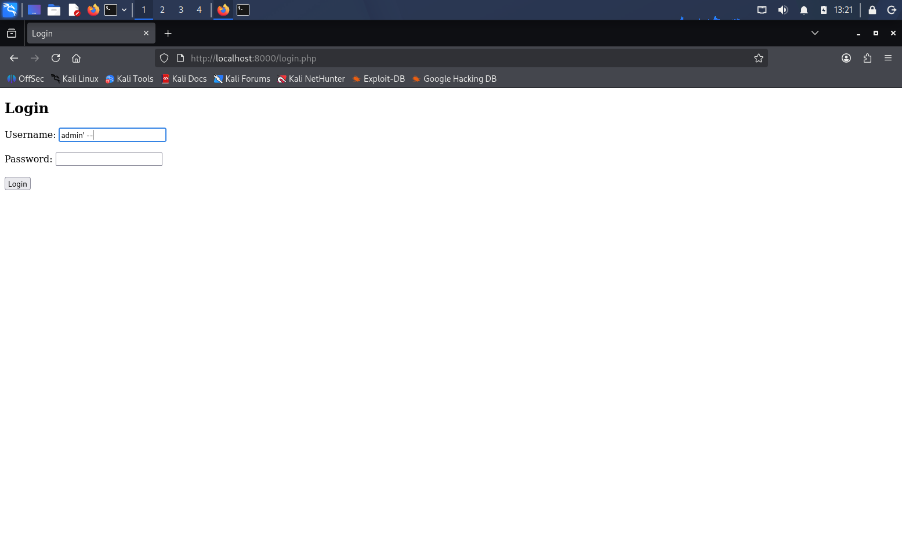
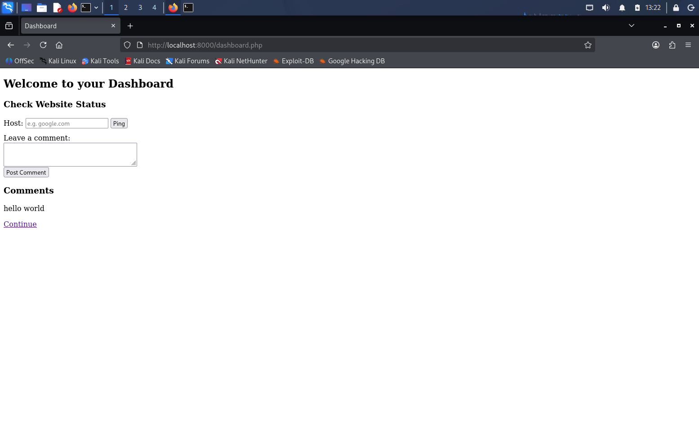
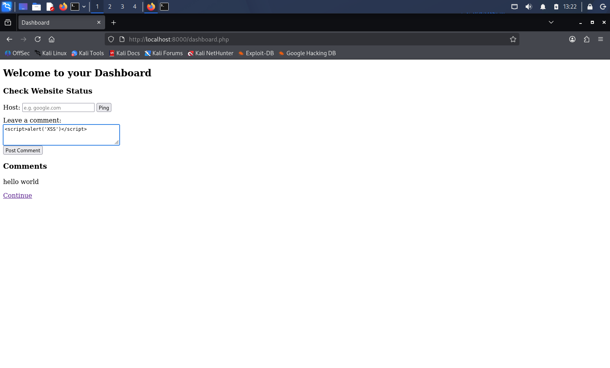
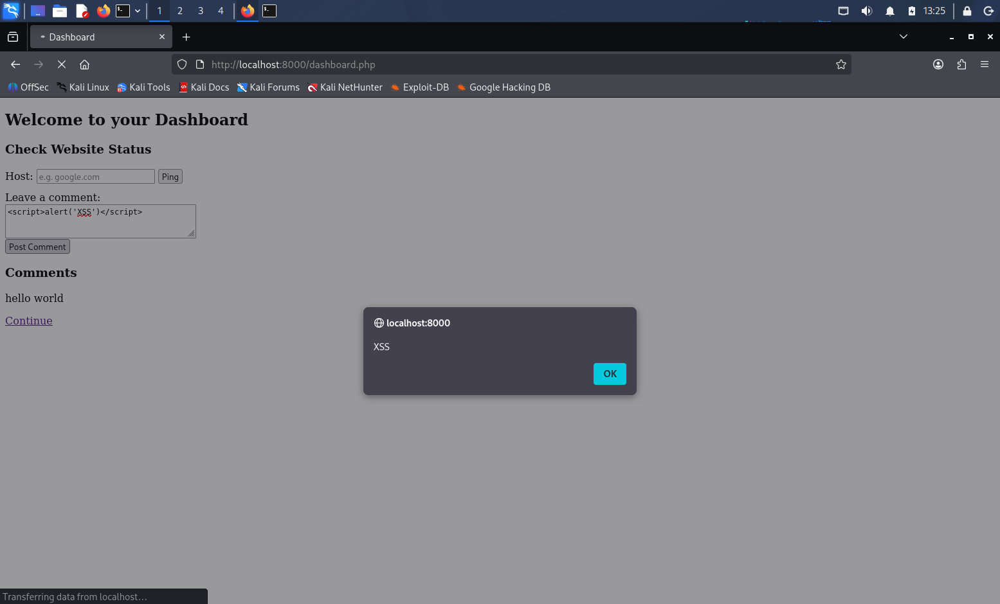
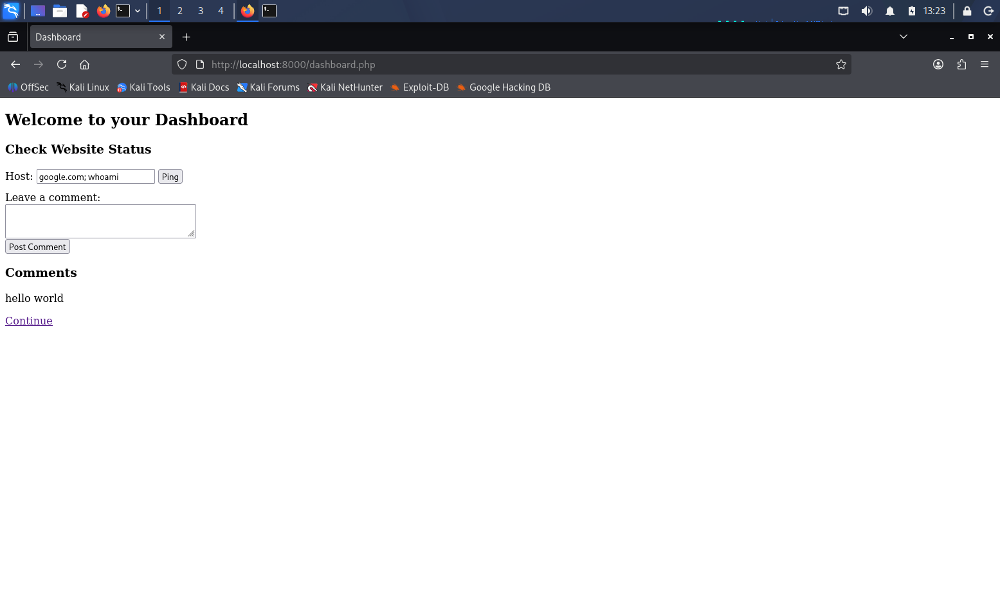
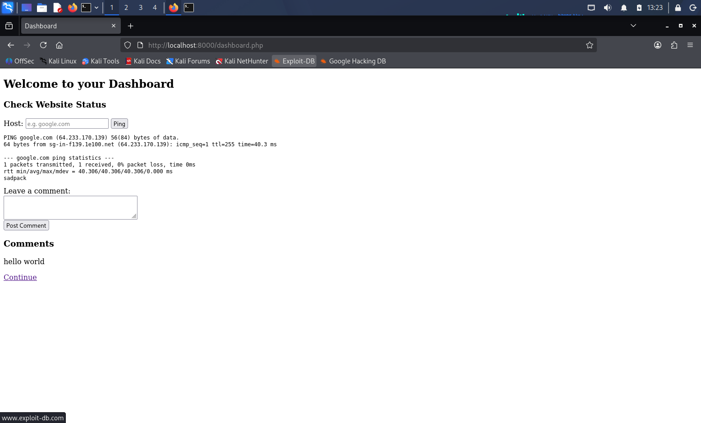
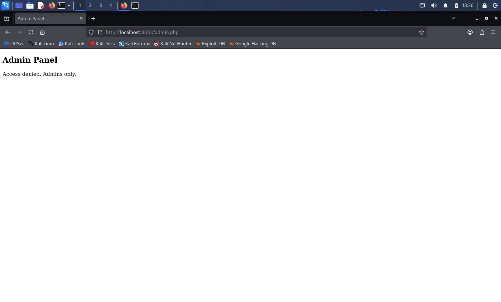
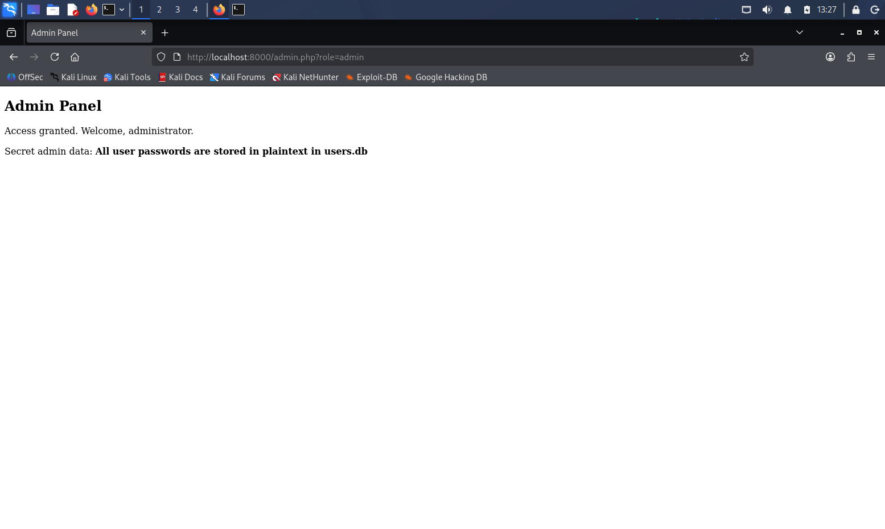
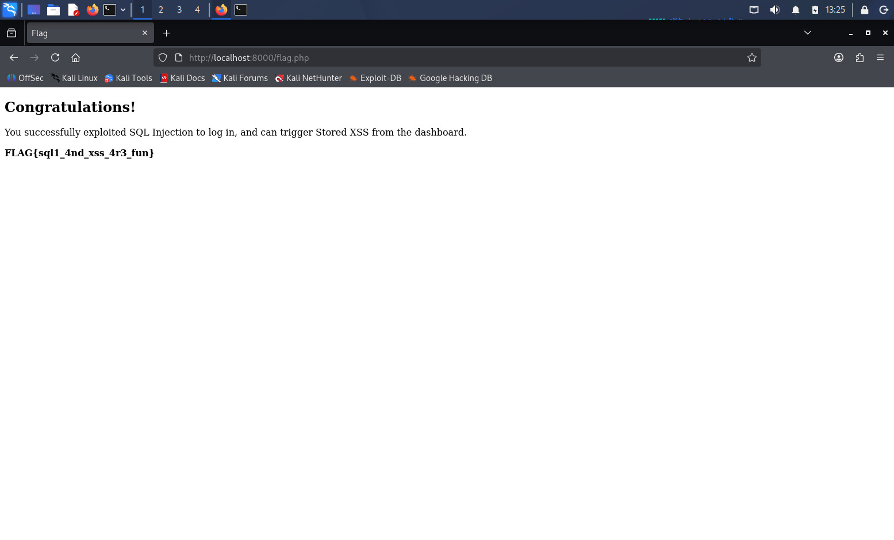

# CTF Walkthrough: Vulnerable PHP Mini App

## Overview
A small, intentionally vulnerable PHP app built to demonstrate four real-world web security vulnerabilities. The goal is to chain a login bypass with a stored XSS exploit to reach a final flag page, with two extra standalone vulnerabilities (command injection and broken access control) to find independently.

**Tech stack:** Kali Linux, PHP, SQLite3, PHP's built-in server.

| # | Vulnerability | Location |
|---|---|---|
| 1 | SQL Injection (Auth Bypass) | `login.php` |
| 2 | Stored XSS | `dashboard.php` |
| 3 | OS Command Injection | `dashboard.php` (ping tool) |
| 4 | Broken Access Control | `admin.php` |

> **Note:** This is a static code repository. GitHub cannot run PHP, so clicking a `.php` file only shows its source code. To actually run the app, download the files and start PHP's built-in server locally (see Setup).

## Setup
```bash
php -S localhost:8000
```
Then open `http://localhost:8000/login.php` in a browser.

---

## 1. SQL Injection — Login Bypass

**Vulnerable code:**
```php
$query = "SELECT * FROM users WHERE username = '$username' AND password = '$password'";
```

**Exploit:** In the Username field, enter `admin' --`, leave Password blank, click Login.

**Why it works:** The `'` closes the string early, and `--` comments out the rest of the query — including the password check. Query becomes:
```sql
SELECT * FROM users WHERE username = 'admin' --' AND password = ''
```

**Fix:** Use parameterized queries (prepared statements).





---

## 2. Stored XSS

**Vulnerable code:**
```php
<p><?php echo $row['comment']; ?></p>
```

**Exploit:** Post a comment containing:
```html
<script>alert('XSS')</script>
```
The alert fires immediately, and again for every future visitor, since the payload is now saved permanently.

**Why it works:** User input is inserted into HTML with no escaping, so the browser runs it as code.

**Fix:** Encode output with `htmlspecialchars()`. Sanitizing input on the way in isn't enough — the fix belongs at output.




---

## 3. OS Command Injection

**Vulnerable code:**
```php
$ping_result = shell_exec("ping -c 1 " . $host);
```

**Exploit:** In the ping tool, enter `google.com; whoami`.

**Why it works:** `;` separates shell commands, so the OS runs `whoami` right after the ping.

**Fix:** Never pass user input into shell functions. Use an allowlist or a native library instead.





---

## 4. Broken Access Control

**Vulnerable code:**
```php
$role = $_GET['role'] ?? 'guest';
if ($role === 'admin') { $access = true; }
```

**Exploit:** Visit `admin.php` (denied), then `admin.php?role=admin` (granted — no login needed).

**Why it works:** Access is decided by a value the visitor controls in the URL, with no real session check.

**Fix:** Enforce access control server-side, based on an authenticated session — never on client-supplied parameters.




---

## Flag

Chaining the SQLi login bypass with dashboard access leads to `flag.php`, rewarding the combined authentication and injection weaknesses.



---

## Summary

| Vulnerability | Root Cause | Fix |
|---|---|---|
| SQL Injection | Unparameterized query | Use prepared statements |
| Stored XSS | Unescaped output | `htmlspecialchars()` on output |
| Command Injection | Unsanitized input to `shell_exec()` | Avoid shell execution with user input |
| Broken Access Control | Trusting client-supplied data for auth | Enforce access checks server-side |

This project shows that vulnerabilities can exist at different stages of a request — input validation, output encoding, system execution, and access control — and a single app can suffer from all of them at once.
